  [图解物体检测 & 网络框架](https://github.com/taylorguo/Deep-Object-Detection/blob/master/assets/README.md)

Inspired by awesome object detection, deep object detection does a easy way for understanding in Chinese.

## 目录

- [图解网络架构](#%E5%9B%BE%E8%A7%A3%E7%BD%91%E7%BB%9C%E6%9E%B6%E6%9E%84)
  - [LeNet_AlexNet](#lenetalexnet)
  - [LeNet_AlexNet_Keras代码实现](#lenetalexnetkeras%E4%BB%A3%E7%A0%81%E5%AE%9E%E7%8E%B0)
  - [VGG16网络与代码实现](#vgg16%E7%BD%91%E7%BB%9C%E4%B8%8E%E4%BB%A3%E7%A0%81%E5%AE%9E%E7%8E%B0)
  - [VGG19网络与代码实现](#vgg19%E7%BD%91%E7%BB%9C%E4%B8%8E%E4%BB%A3%E7%A0%81%E5%AE%9E%E7%8E%B0)
  - [Resnet](#resnet)
  - [ResNeXt:2016](#resnext2016)
  - [Xception:2016](#xception2016)
  - [SqueezeNet:2016](#squeezenet2016)
  - [DenseNet:2016](#densenet2016)
  - [MobileNet-v1:2017](#mobilenet-v12017)
  - [ShuffleNet:2017](#shufflenet2017)
  - [SENet : 2017](#senet--2017)
  - [MobileNet-V2:2018](#mobilenet-v22018)
  - [ShuffleNet-V2: 2018](#shufflenet-v2-2018)
- [图解Object_Detection框架](#%E5%9B%BE%E8%A7%A3objectdetection%E6%A1%86%E6%9E%B6)
  - [Multi-stage Object Detection](#multi-stage-object-detection)
    - [RCNN : 2014](#rcnn--2014)
    - [SPPnet : 2014](#sppnet--2014)
    - [FCN : 2015](#fcn--2015)
    - [Fast R-CNN : 2015](#fast-r-cnn--2015)
    - [Faster R-CNN : 2015](#faster-r-cnn--2015)
    - [FPN : 2016](#fpn--2016)
    - [Mask R-CNN : 2017](#mask-r-cnn--2017)
  - [Single Stage Object Detection](#single-stage-object-detection)
    - [DenseBox : 2015](#densebox--2015)
    - [SSD : 2016](#ssd--2016)
    - [YoLov2 : 2016](#yolov2--2016)
    - [RetinaNet : 2017](#retinanet--2017)
    - [YoLov3 : 2018](#yolov3--2018)
    - [M2Det : 2019](#m2det--2019)
    - [CornerNet-Lite : 2019](#cornernet-lite--2019)
- [数据集Object_Detection](#%E6%95%B0%E6%8D%AE%E9%9B%86objectdetection)
  - [General Dataset](#general-dataset)
  - [Animal](#animal)
  - [Plant](#plant)
  - [Food](#food)
  - [Transportation](#transportation)
  - [Scene](#scene)
  - [Face](#face)

# 图解网络架构

## LeNet_AlexNet
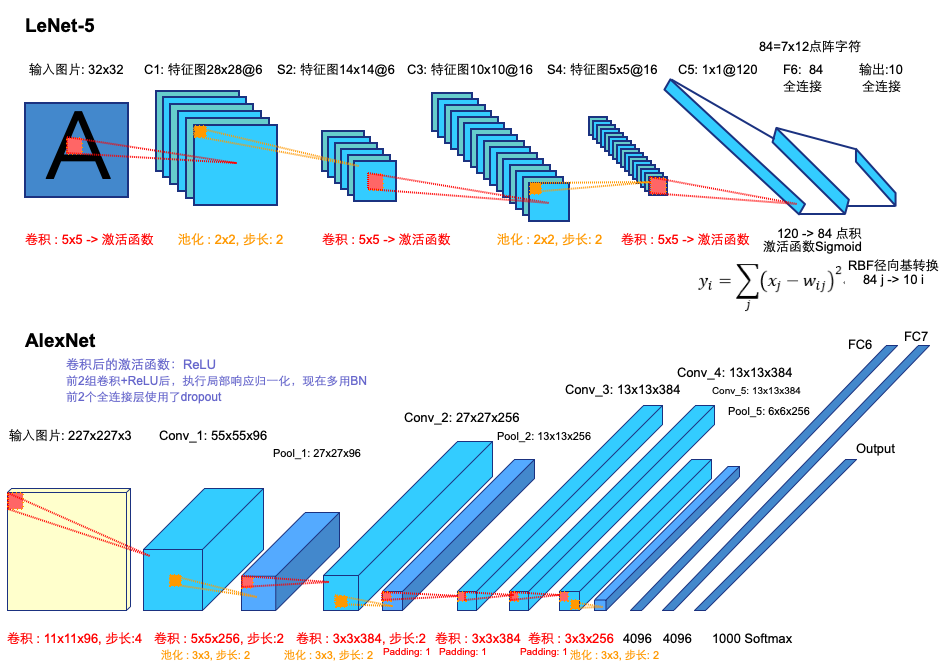

## LeNet_AlexNet_Keras代码实现

[LeNet-Keras for mnist handwriting digital image classification](https://github.com/taylorguo/Deep-Object-Detection/blob/master/sample-code/network/lenet_keras.py)

LeNet-Keras restructure

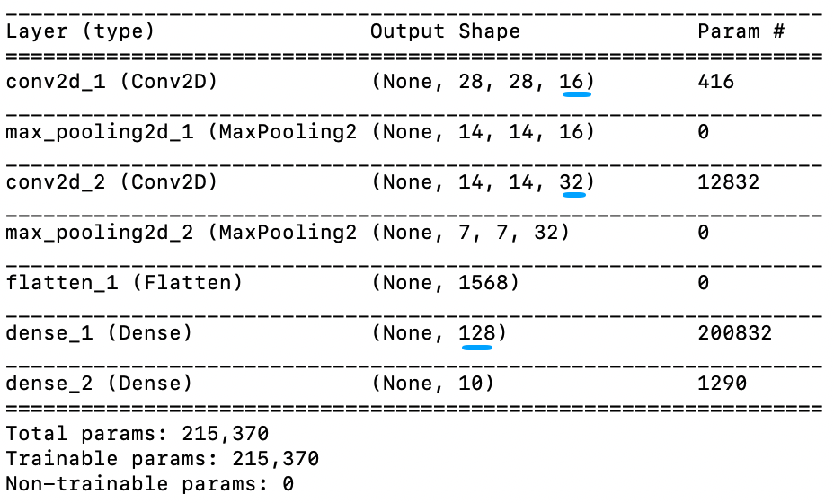
Accuracy: 98.54%

===================================

[AlexNet-Keras for oxflower17 image classification](https://github.com/taylorguo/Deep-Object-Detection/blob/master/sample-code/network/alexnet_keras.py)

AlexNet-Keras restructure: 修改后的网络 val_acc: ~80%, 过拟合

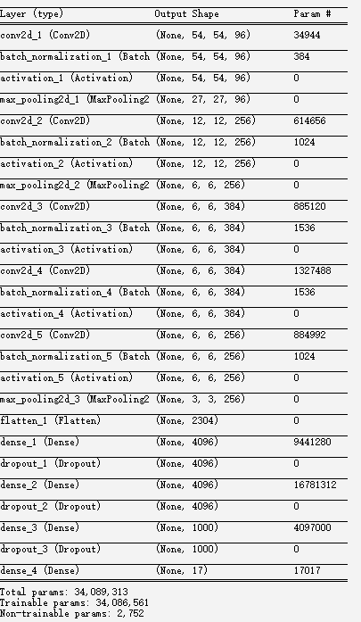

===================================
## VGG16网络与代码实现

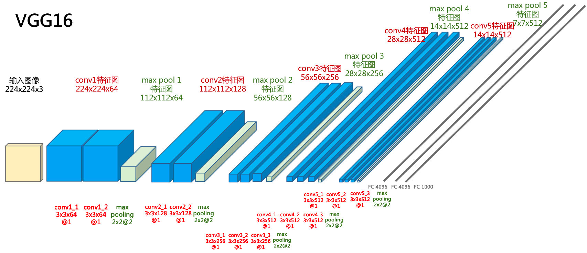

[VGG16 Keras 官方代码实现](https://github.com/taylorguo/Deep-Object-Detection/blob/master/sample-code/network/vgg16.py)

[VGG16-Keras oxflower17 物体分类](https://github.com/taylorguo/Deep-Object-Detection/blob/master/sample-code/network/vgg16_keras.py): 修改后的网络 val_acc: ~86.4%, 过拟合

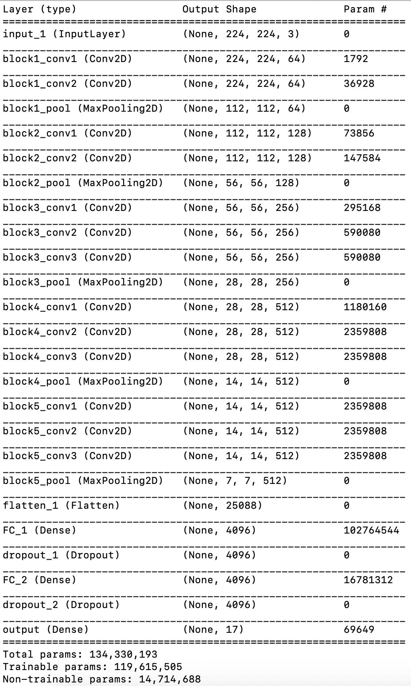

## VGG19网络与代码实现

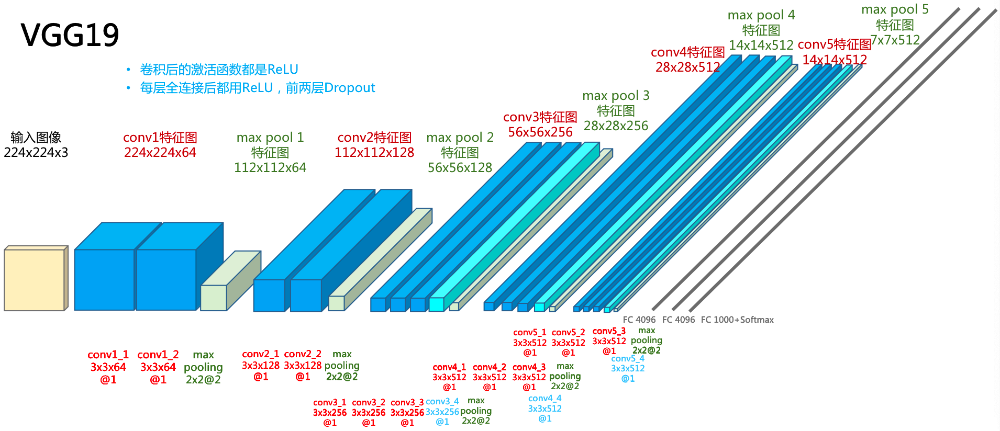

[VGG19 Keras 官方代码实现](https://github.com/taylorguo/Deep-Object-Detection/blob/master/sample-code/network/vgg19.py)

## Resnet

- ResNet [Deep Residual Learning for Image Recognition](https://arxiv.org/pdf/1512.03385.pdf) - CVPR
  
    - 残差块与直连层:
  
        

    - 残差网络架构:
   
        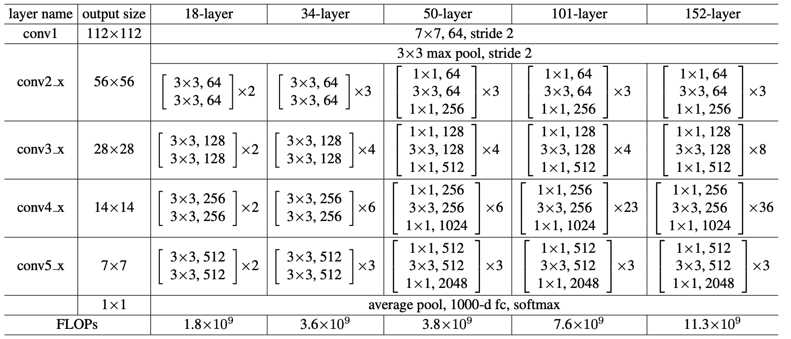

    - 残差网络中 Shortcut Connection 参考文章

        - 1995 - [Neural networks for pattern recognition - Bishop]()
        - 1996 - [Pattern recognition and neural networks - Ripley]()
        - 1999 - [Modern applied statistics with s-plus - Venables & Ripley]()

- [Highway Networks](https://arxiv.org/pdf/1505.00387v2.pdf), [中文翻译参考](https://www.cnblogs.com/2008nmj/p/9104744.html)

- [Convolutional Neural Networks at Constrained Time Cost](https://arxiv.org/pdf/1412.1710.pdf)

    - 实验表明: 加深网络, 会出现训练误差

===================================

## ResNeXt:2016

- [ResNeXt](https://arxiv.org/pdf/1611.05431.pdf): Aggregated Residual Transformations for Deep Neural Networks

## Xception:2016

- [Xception](https://arxiv.org/pdf/1610.02357.pdf): Deep Learning with Depthwise Separable Convolutions

## SqueezeNet:2016

- [SqueezeNet](https://arxiv.org/pdf/1602.07360.pdf): AlexNet-level accuracy with 50x fewer parameters and <0.5MB model size

## DenseNet:2016

- [DenseNet](https://arxiv.org/pdf/1608.06993.pdf) : Densely Connected Convolutional Networks
  
- [DenseNet- Github](https://github.com/liuzhuang13/DenseNet#results-on-imagenet-and-pretrained-models)
    - Dense Block 层间链接采用concat, 而不是按元素add

## MobileNet-v1:2017

- [MobileNets](https://arxiv.org/pdf/1704.04861.pdf) : Efficient Convolutional Neural Networks for Mobile Vision Applications

## ShuffleNet:2017

- [ShuffleNet](https://arxiv.org/pdf/1707.01083.pdf): An Extremely Efficient Convolutional Neural Network for Mobile Devices
  
- 图解ShuffleNet单元块:

    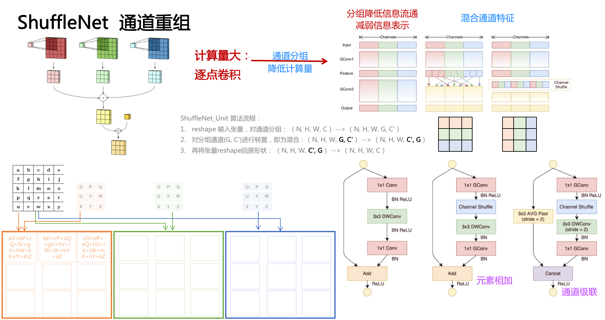

- Code:
  - [ShuffleNet Tensorflow](https://github.com/MG2033/ShuffleNet)

## SENet : 2017

- [SENet](https://arxiv.org/pdf/1709.01507.pdf) Squeeze-and-Excitation Networks

## MobileNet-V2:2018

- [MobileNetV2 ](https://arxiv.org/pdf/1801.04381.pdf): Inverted Residuals and Linear Bottlenecks

## ShuffleNet-V2: 2018

- [ShuffleNet V2](https://arxiv.org/pdf/1807.11164.pdf): Practical Guidelines for Efficient CNN Architecture Design

=============================

# [图解Object_Detection框架](https://github.com/taylorguo/Deep-Object-Detection/blob/master/assets/README.md)

通用文档

- [cs231n : Spatial Localization and Detection](http://cs231n.stanford.edu/slides/2016/winter1516_lecture8.pdf)

2010

- [Object Detection with Discriminatively Trained Part Based Models](http://cs.brown.edu/people/pfelzens/papers/lsvm-pami.pdf)

2011

- [Ensemble of Exemplar-SVMs for Object Detection and Beyond](http://www.cs.cmu.edu/~efros/exemplarsvm-iccv11.pdf)

2013 

- [OverFeat: Integrated Recognition, Localization and Detection using Convolutional Networks](https://arxiv.org/pdf/1312.6229.pdf)

    - [Code](https://github.com/sermanet/OverFeat)

    - sliding window detector on an image pyramid

2014

- [VGG: Very Deep Convolutional Networks for Large-Scale Image Recognition](http://www.arxiv.org/pdf/1409.1556.pdf)

- SPP: [Spatial Pyramid Pooling in Deep Convolutional Networks for Visual Recognition](https://arxiv.org/pdf/1406.4729.pdf)

2017

- [On the Origin of Deep Learning](https://arxiv.org/pdf/1702.07800.pdf)

2018

- [A guide to convolution arithmetic for deep learning](https://arxiv.org/pdf/1603.07285.pdf)

- [Progressive Neural Architecture Search](https://arxiv.org/pdf/1712.00559.pdf)

===========================

## Multi-stage Object Detection

###  RCNN : 2014

  - [Region-Based Convolutional Networks for Accurate Object Detection and Segmentation](http://medialab.sjtu.edu.cn/teaching/CV/hw/related_papers/3_detection.pdf)

  - v5 [Rich feature hierarchies for accurate object detection and semantic segmentation](https://arxiv.org/pdf/1311.2524v3.pdf) - CVPR

  - region proposal with scale-normalized before classifying with a ConvNet

    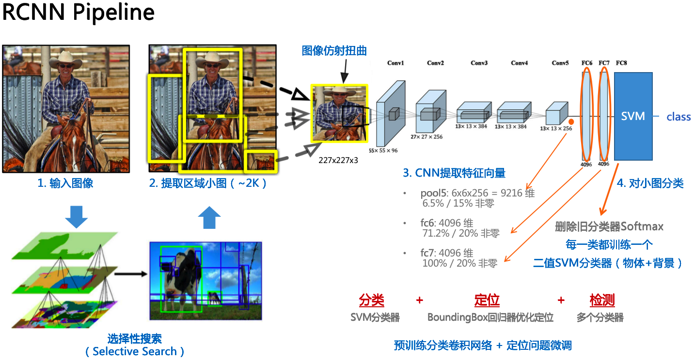

  - [RCNN Keras Code](https://github.com/yhenon/keras-rcnn)

    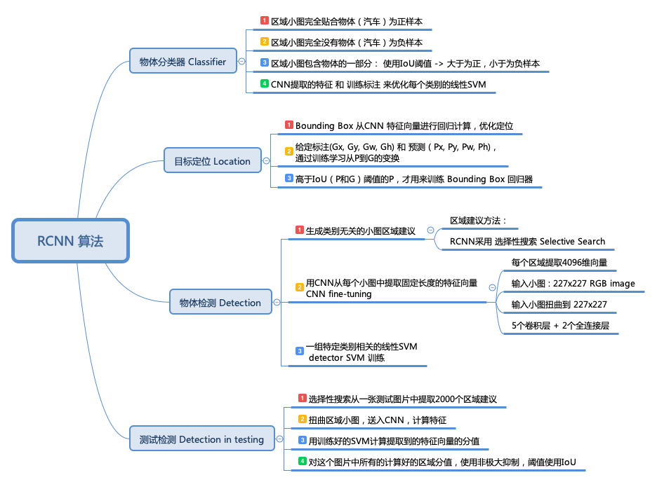
    

###  SPPnet : 2014

- SPPnet [Spatial Pyramid Pooling in Deep Convolutional Networks for Visual Recognition](https://arxiv.org/pdf/1406.4729.pdf) - ECCV
    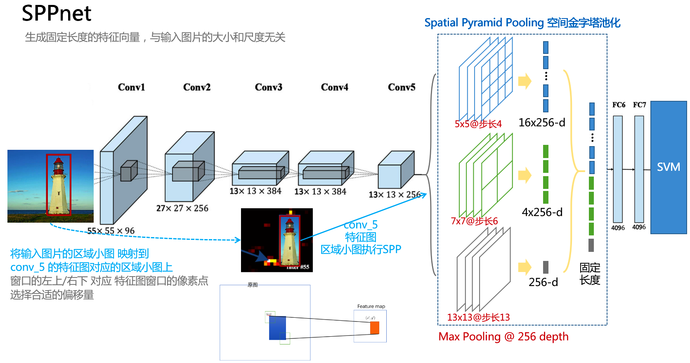

    - [ROI Pooling ](http://wavelab.uwaterloo.ca/wp-content/uploads/2017/04/Lecture_6.pdf)

### FCN : 2015

- FCN -[Fully convolutional networks for semantic segmentation](https://arxiv.org/pdf/1411.4038.pdf) - CVPR
    - 全卷积网络将最后的三层全连接层, 用多通道同尺寸卷积核, 转换成卷积层; 使输入图像尺寸可以改动

        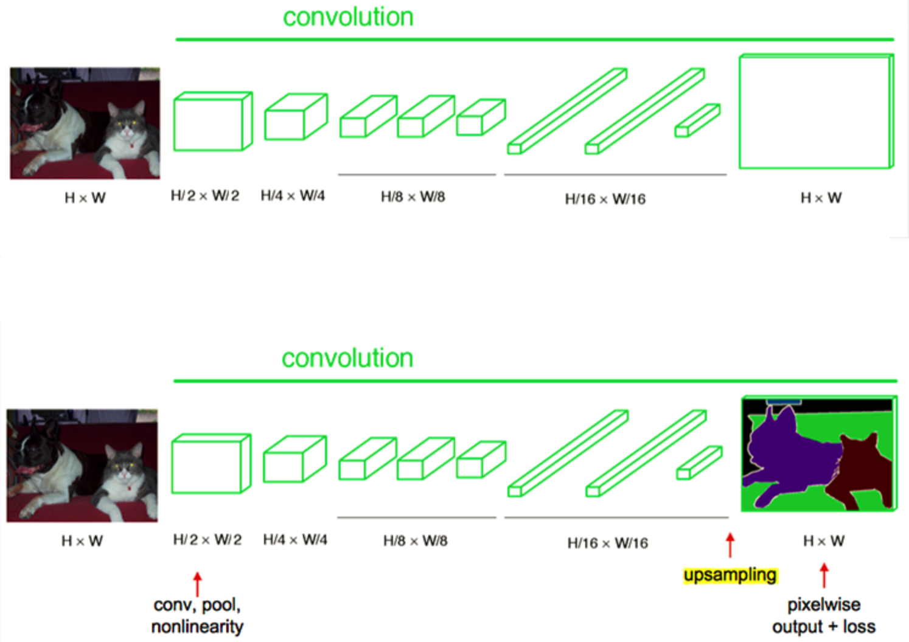

    - 语义分割的网络结构:  
      - 提取不同的池化层特征图, 对特征图进行上采样
      - 上采样使用反卷积(转置卷积) : 导致反卷积后的图像不够细致
      - 跳层结构, 特征图融合: 元素按像素相加(Keras里面 add 函数)
      - 将特征图转换成原图像大小进行像素预测

        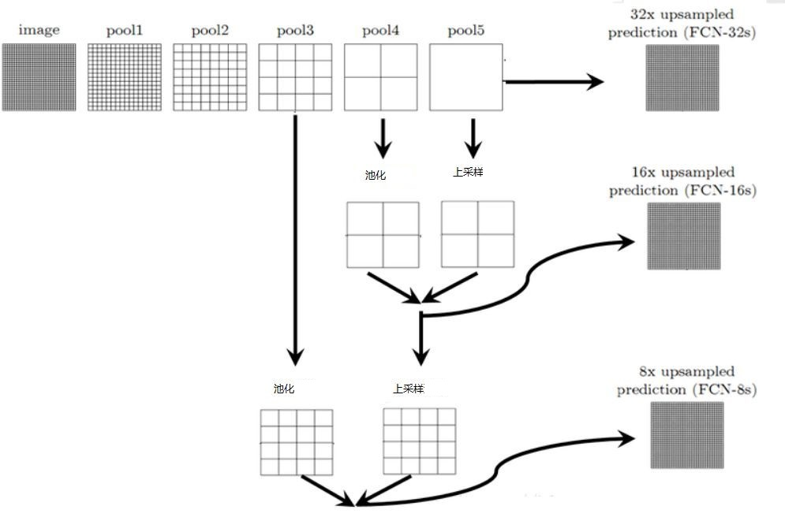

        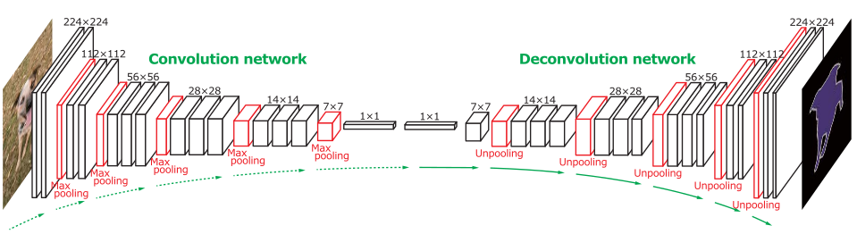

    - 语义分割的问题定义:
      - 像素值二分类
      - 最后一层卷积为1x1x21(VOC 20类物体+1类背景)

        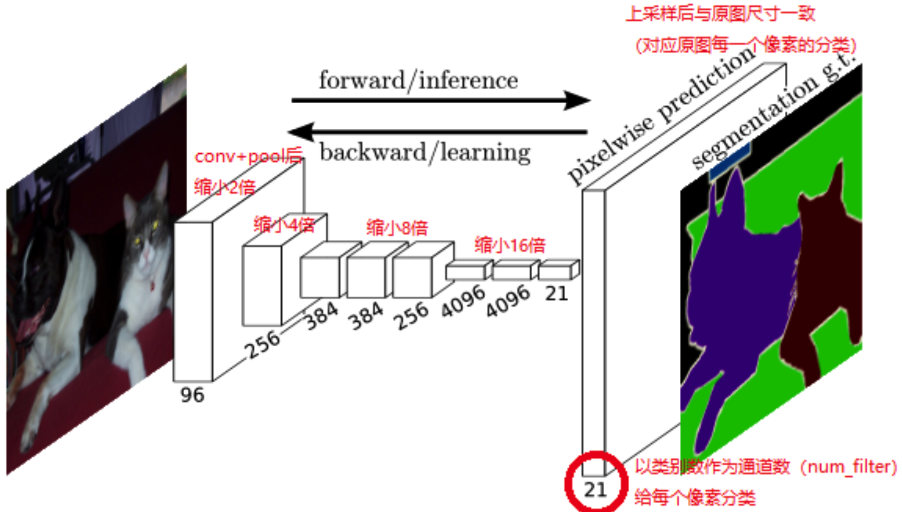

        [参考资料: 全卷积网络 FCN 详解](https://blog.csdn.net/sinat_24143931/article/details/78696442)

        [参考资料: 10分钟看懂FCN: 语义分割深度模型先驱](http://www.sohu.com/a/270896638_633698)

    - code:
      - [FCN in tensorflow](https://github.com/MarvinTeichmann/tensorflow-fcn)
      - [FCN offical](https://github.com/shelhamer/fcn.berkeleyvision.org)

### Fast R-CNN : 2015

- [Fast R-CNN](https://arxiv.org/pdf/1504.08083.pdf) - ICCV

    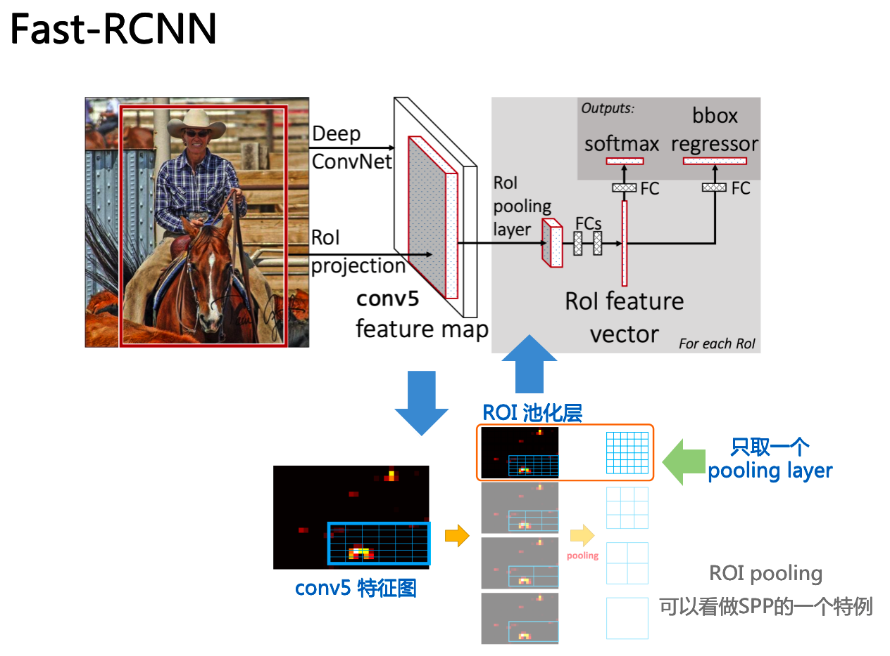

### Faster R-CNN : 2015

- [Faster R-CNN: To- wards real-time object detection with region proposal net- works](https://arxiv.org/pdf/1506.01497.pdf) - NIPS

    - RPN(Region Proposal Network) & Anchor Box

    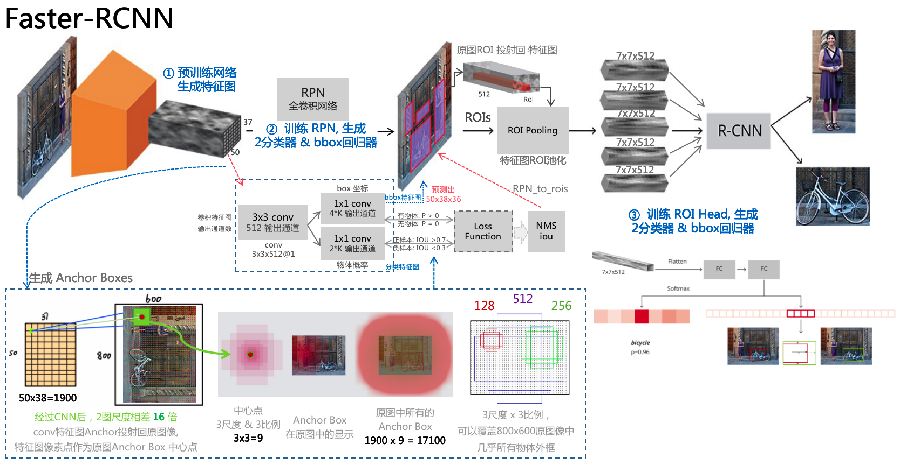

    - [Convolutional Feature Maps](http://kaiminghe.com/iccv15tutorial/iccv2015_tutorial_convolutional_feature_maps_kaiminghe.pdf)

- 物体检索 [Faster R-CNN Features for Instance Search](https://arxiv.org/pdf/1604.08893.pdf) 

### FPN : 2016

- [Feature Pyramid Networks for Object Detection](https://arxiv.org/pdf/1612.03144.pdf)

    - Idea from traditional CV feature pyramids, for compute and memory intensive in DL 

        想法源自传统计算机视觉中的特征金字塔, 深度学习中没用是因为计算密集,占内存

    - bottome-up in FeedForward: deepest layer of each stage should have the strongest features
    
        每阶段的最深的一层应该有最强的特征

    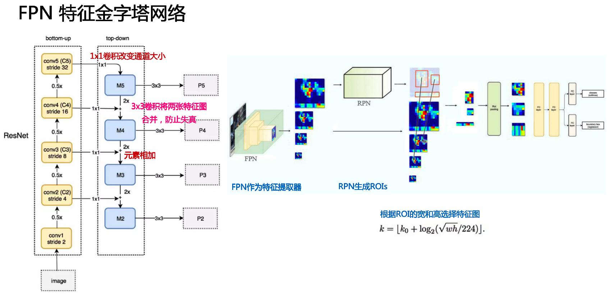

    - [参考文档: Understanding FPN](https://medium.com/@jonathan_hui/understanding-feature-pyramid-networks-for-object-detection-fpn-45b227b9106c)
  
    - Code:
      - [FPN in Mask-RCNN Keras Code](https://github.com/matterport/Mask_RCNN/blob/master/mrcnn/model.py)
      - [FPN in Tensorflow](https://github.com/yangxue0827/FPN_Tensorflow)
      - [FPN in Caffe](https://github.com/unsky/FPN)

### Mask R-CNN : 2017 

- [Mask R-CNN](https://arxiv.org/pdf/1703.06870.pdf)
  - Code:
    - [Keras matterport](https://github.com/matterport/Mask_RCNN)
    - [Caffe2 Facebook](https://github.com/facebookresearch/Detectron)
    - [PyTorch wannabeOG](https://github.com/wannabeOG/Mask-RCNN)
    - [MXNet TuSimple](https://github.com/TuSimple/mx-maskrcnn)
    - [Chainer DeNA](https://github.com/DeNA/Chainer_Mask_R-CNN)

============================
## Single Stage Object Detection

### DenseBox : 2015

- [DenseBox: Unifying Landmark Localization with End to End Object Detection](https://arxiv.org/pdf/1509.04874.pdf)

### SSD : 2016

- [SSD: Single Shot MultiBox Detector](https://arxiv.org/pdf/1512.02325.pdf) - ECCV

    - 工作流程:

        - 特征提取网络为VGG-16, 边界框 和 分类 为特征图金字塔
    
    - 网络架构: 

        

    - 损失函数:

        - 位置Smooth L1 Loss 和 多分类Softmax 的和

             

### YoLov2 : 2016

- YOLOv2 [YOLO9000: Better, Faster, Stronger](https://arxiv.org/pdf/1612.08242.pdf)

    - 工作流程：

        - 在图像分类任务上预训练 CNN网络

        - 图像拆分为单元格, 如果一个对象的中心在一个单元格内，该单元格就“负责”检测该对象
            
            每个单元预测（a）边界框位置，（b）置信度分数，（c）以边界框中的对象的存在为条件的对象类的概率

        - 修改预训练的CNN的最后一层以输出预测张量
    
    - 网络架构:

        

    - 损失函数:

        - 2部分组成: 边界框回归 和 分类条件概率 - 都采用平方差的和

             

### RetinaNet : 2017

- RetinaNet:[Focal Loss for Dense Object Detection](https://arxiv.org/pdf/1708.02002.pdf)

    - 工作流程:

        - 焦点损失为明显的,容易错误分类的情况(具有噪声纹理或部分对象的背景)分配更多权重，并且降低简单情况权重(明显空白背景)
        
        - 特征提取网络为ResNet, 特征金字塔提高检测性能

            

    - 网络架构:

        

    

### YoLov3 : 2018

- [YOLOv3: An Incremental Improvement](https://arxiv.org/pdf/1804.02767.pdf)

    - bbox 预测使用尺寸聚类

        - 每个box有4个坐标

        - 训练时, 使用误差平方和损失函数 sum of squared error loss

        - bbox object分值, 用 logistic regression

        - 分类器 使用 logistic regression, 损失函数binary cross-entropy

    - 借鉴了 FPN 网络

    - 特征提取卷积网络

        - 3x3, 1x1 卷积层交替

        - 借鉴了 ResNet, 使用了直连, 分别从卷积层或直连层进行直连

### M2Det : 2019 

- [M2Det](https://arxiv.org/pdf/1811.04533.pdf)

### CornerNet-Lite : 2019

- [CornerNet-Lite](https://arxiv.org/pdf/1904.08900.pdf) : Efficient Keypoint Based Object Detection
  - CornerNet-Saccade: 处理特征图的像素, 一个裁剪多个检测; 离线处理
  - CornetNet-Squeeze: 骨干网络, 使用SqueezeNet, 沙漏架构; 实时处理

[参考资料: 目标检测算法总结](https://www.cnblogs.com/guoyaohua/p/8994246.html)

=============================

# 数据集Object_Detection

不确定每个数据集都包含完整的物体检测数据标注。

## General Dataset

- [数据集收集 Dataset Collection](http://www.escience.cn/people/lichang/Data.html)

- [数据集: 25种简介](https://www.easemob.com/news/1433)

- [ImageNet 最大的图像识别图像库](http://www.image-net.org/)

    - 14,197,122张图像

- [PASCAL Visual Object Classes Challenge 2008 (VOC2008)](http://host.robots.ox.ac.uk/pascal/VOC/voc2008/htmldoc/voc.html), [VOC-2012](http://pjreddie.com/projects/pascal-voc-dataset-mirror/)

- [Open Images dataset(带标注)](https://github.com/openimages/dataset)

    - 近900万个图像URL数据集, 数千个类的图像级标签边框并且进行了标注。
    
    - 数据集包含9,011,219张图像的训练集, 41,260张图像的验证集, 125,436张图像的测试集。

- [Corel5K 图像集](https://github.com/watersink/Corel5K)

    - Corel5K图像集，共5000幅图片，包含50个语义主题，有公共汽车、恐龙、海滩等。

## Animal

[Stanford Dogs 🐶 Dataset : Over 20,000 images of 120 dog breeds](https://www.kaggle.com/jessicali9530/stanford-dogs-dataset)

- Context

    The Stanford Dogs dataset contains images of 120 breeds of dogs from around the world. This dataset has been built using images and annotation from ImageNet for the task of fine-grained image categorization. It was originally collected for fine-grain image categorization, a challenging problem as certain dog breeds have near identical features or differ in colour and age.

    来源于imagenet, 用于图像细粒度分类

- Content

    - Number of categories: 120
    - Number of images: 20,580
    - Annotations: Class labels, Bounding boxes

[Honey Bee pollen : High resolution images of individual bees on the ramp](https://www.kaggle.com/ivanfel/honey-bee-pollen)

- Context

    This image dataset has been created from videos captured at the entrance of a bee colony in June 2017 at the Bee facility of the Gurabo Agricultural Experimental Station of the University of Puerto Rico.
    
    识别 蜜蜂 🐝 授粉 或者 未授粉

- Content

    - images/ contains images for pollen bearing and no pollen bearing honey bees.

        - The prefix of the images names define their class: e.g. NP1268-15r.jpg for non-pollen and P7797-103r.jpg for pollen bearing bees. 
        - The numbers correspond to frame and item number respectively, you need to be careful that they are not numbered sequentially.

    - Read-skimage.ipynb Jupyter notebook for simple script to load the data and create the dataset using skimage library.

## Plant

[Flowers Recognition : This dataset contains labeled 4242 images of flowers.](https://www.kaggle.com/alxmamaev/flowers-recognition)

- Context

    This dataset contains 4242 images of flowers. The data collection is based on the data flicr, google images, yandex images. You can use this datastet to recognize plants from the photo.

    

- Content

    - five classes: chamomile, tulip, rose, sunflower, dandelion
    - each class there are about 800 photos
    - resolution: about 320x240 pixels

[VGG - 17 Category Flower Dataset](http://www.robots.ox.ac.uk/~vgg/data/flowers/17/index.html)

- Context

    - 17 category flower dataset with 80 images for each class
    - 80 images for each category
    

- Content

    - The datasplits used in this paper are specified in datasplits.mat

    - There are 3 separate splits. The results in the paper are averaged over the 3 splits.

    - Each split has a training file (trn1,trn2,trn3), a validation file (val1, val2, val3) and a testfile (tst1, tst2 or tst3). 

[VGG - 102 Category Flower Dataset](http://www.robots.ox.ac.uk/~vgg/data/flowers/102/index.html)

- Context

    - 102 category dataset, consisting of 102 flower categories
    - Each class consists of between 40 and 258 images
    

- Content

    - The datasplits used in this paper are specified in setid.mat.

    - The results in the paper are produced on a 103 category database. - - The two categories labeled Petunia have since been merged since they are the same.
    - There is a training file (trnid), a validation file (valid) and a testfile (tstid).

[Fruits 360 dataset : A dataset with 65429 images of 95 fruits](https://www.kaggle.com/moltean/fruits)

- Context

    The following fruits are included: Apples (different varieties: Golden, Red Yellow, Granny Smith, Red, Red Delicious), Apricot, Avocado, Avocado ripe, Banana (Yellow, Red, Lady Finger), Cactus fruit, Cantaloupe (2 varieties), Carambula, Cherry (different varieties, Rainier), Cherry Wax (Yellow, Red, Black), Chestnut, Clementine, Cocos, Dates, Granadilla, Grape (Blue, Pink, White (different varieties)), Grapefruit (Pink, White), Guava, Hazelnut, Huckleberry, Kiwi, Kaki, Kumsquats, Lemon (normal, Meyer), Lime, Lychee, Mandarine, Mango, Mangostan, Maracuja, Melon Piel de Sapo, Mulberry, Nectarine, Orange, Papaya, Passion fruit, Peach (different varieties), Pepino, Pear (different varieties, Abate, Kaiser, Monster, Williams), Physalis (normal, with Husk), Pineapple (normal, Mini), Pitahaya Red, Plums (different varieties), Pomegranate, Pomelo Sweetie, Quince, Rambutan, Raspberry, Redcurrant, Salak, Strawberry (normal, Wedge), Tamarillo, Tangelo, Tomato (different varieties, Maroon, Cherry Red), Walnut.

    
- Content

    - Total number of images: 65429.
        - Training set size: 48905 images (one fruit per image).
        - Test set size: 16421 images (one fruit per image).
        - Multi-fruits set size: 103 images (more than one fruit (or fruit class) per image)
    - Number of classes: 95 (fruits).
    - Image size: 100x100 pixels.

- [GitHub download: Fruits-360 dataset](https://github.com/Horea94/Fruit-Images-Dataset)

[Plant Seedlings Classification : Determine the species of a seedling from an image](https://www.kaggle.com/c/plant-seedlings-classification)

- Context

    - a dataset containing images of approximately 960 unique plants belonging to 12 species at several growth stages

- Content

    - [A Public Image Database for Benchmark of Plant Seedling Classification Algorithms](https://arxiv.org/abs/1711.05458)

[V2 Plant Seedlings Dataset : Images of crop and weed seedlings at different growth stages](https://www.kaggle.com/vbookshelf/v2-plant-seedlings-dataset)

- Context
    - The V1 version of this dataset was used in the Plant Seedling Classification playground competition here on Kaggle. This is the V2 version. Some samples in V1 contained multiple plants. The dataset’s creators have now removed those samples.

- Content

    - This dataset contains 5,539 images of crop and weed seedlings. 
    - The images are grouped into 12 classes as shown in the above pictures. These classes represent common plant species in Danish agriculture. Each class contains rgb images that show plants at different growth stages. 
    - The images are in various sizes and are in png format.

## Food

[UEC Food-256 Japan Food](http://foodcam.mobi/dataset256.html)

- Context

    - The dataset "UEC FOOD 256" contains 256-kind food photos. Each food photo has a bounding box indicating the location of the food item in the photo. 

    - Most of the food categories in this dataset are popular foods in Japan and other countries. 

- Content 

    - [1-256] : directory names correspond to food ID.
    - [1-256]/*.jpg : food photo files (some photos are duplicated in two or more directories, since they includes two or more food items.)
    - [1-256]/bb_info.txt: bounding box information for the photo files in each directory

    - category.txt : food list including the correspondences between food IDs and food names in English
    - category_ja.txt : food list including the correspondences between food IDs and food names in Japanese
    - multiple_food.txt: the list representing food photos including two or more food items

[FoodDD: Food Detection Dataset](http://www.site.uottawa.ca/~shervin/food/), [论文](http://www.site.uottawa.ca/~shervin/pubs/FoodRecognitionDataset-MadiMa.pdf)

[NutriNet: A Deep Learning Food and Drink Image Recognition System for Dietary Assessment](https://www.ncbi.nlm.nih.gov/pmc/articles/PMC5537777/)

[ChineseFoodNet: A large-scale Image Dataset for Chinese Food Recognition - 2017](https://arxiv.org/pdf/1705.02743.pdf)

[Yummly-28K - 2017](http://isia.ict.ac.cn/dataset/)

    - Content 
    
        - 27,638 recipes in total. 
        - Each recipe contains one recipe image, the ingredients, the cuisine and the course information.     
        - There are 16 kinds of cuisines (e.g,“American”,“Italian” and “Mexican”) 
        - and 13 kinds of recipe courses (e.g, “Main Dishes”,“Desserts” and “Lunch and Snacks”).

[VireoFood-172 dataset](http://vireo.cs.cityu.edu.hk/vireofood172/),   [论文-2016](http://vireo.cs.cityu.edu.hk/jingjing/papers/chen2016deep.pdf)

[Dishes: a restaurant-oriented food dataset - 2015](http://isia.ict.ac.cn/dataset/Geolocation-food/)

## Transportation

[Boat types recognition : About 1,500 pictures of boats classified in 9 categories](https://www.kaggle.com/clorichel/boat-types-recognition)

- Context

    This dataset is used on this blog post https://clorichel.com/blog/2018/11/10/machine-learning-and-object-detection/ where you'll train an image recognition model with TensorFlow to find about anything on pictures and videos.

    

- Content

    1,500 pictures of boats, of various sizes, but classified by those different types: buoy, cruise ship, ferry boat, freight boat, gondola, inflatable boat, kayak, paper boat, sailboat.

## Scene

[Intel Image Classification : Image Scene Classification of Multiclass](https://www.kaggle.com/puneet6060/intel-image-classification)

- Context

    image data of Natural Scenes around the world

    

- Content

    - This Data contains around 25k images of size 150x150 distributed under 6 categories. {'buildings' -> 0, 'forest' -> 1, 'glacier' -> 2, 'mountain' -> 3, 'sea' -> 4, 'street' -> 5 }

    - The Train, Test and Prediction data is separated in each zip files. There are around 14k images in Train, 3k in Test and 7k in Prediction. This data was initially published on https://datahack.analyticsvidhya.com by Intel to host a Image classification Challenge.

## Face 

[CelebFaces Attributes (CelebA) Dataset : Over 200K images of celebrities with 40 binary attribute annotations](https://www.kaggle.com/jessicali9530/celeba-dataset/version/2)

