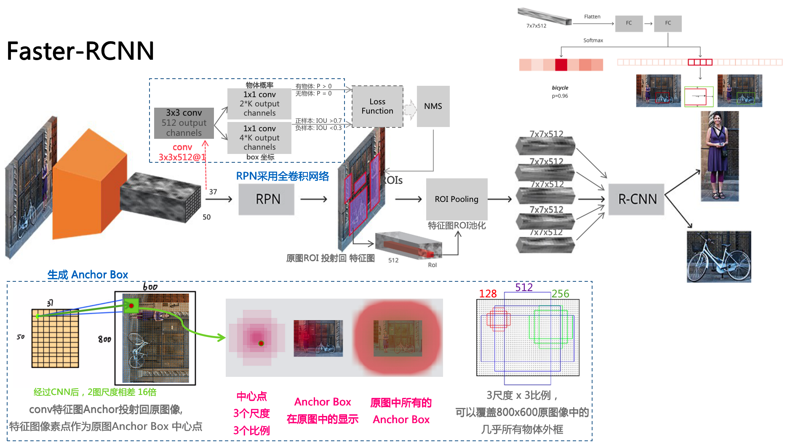

## Reading List

### General Information

- [cs231n : Spatial Localization and Detection](http://cs231n.stanford.edu/slides/2016/winter1516_lecture8.pdf)

2010

- [Object Detection with Discriminatively Trained Part Based Models](http://cs.brown.edu/people/pfelzens/papers/lsvm-pami.pdf)

2011

- [Ensemble of Exemplar-SVMs for Object Detection and Beyond](http://www.cs.cmu.edu/~efros/exemplarsvm-iccv11.pdf)

2012

- [AlexNet]()

2013 

- [OverFeat: Integrated Recognition, Localization and Detection using Convolutional Networks](https://arxiv.org/pdf/1312.6229.pdf)

    - [Code](https://github.com/sermanet/OverFeat)

    - sliding window detector on an image pyramid

    - 

2014

- [VGG]()

- SPP: [Spatial Pyramid Pooling in Deep Convolutional Networks for Visual Recognition](https://arxiv.org/pdf/1406.4729.pdf)

2015

- [Highway Networks](https://arxiv.org/pdf/1505.00387v2.pdf), [中文翻译参考](https://www.cnblogs.com/2008nmj/p/9104744.html)

- [Convolutional Neural Networks at Constrained Time Cost](https://arxiv.org/pdf/1412.1710.pdf)

    - 实验表明: 加深网络, 会出现训练误差

- ResNet [Deep Residual Learning for Image Recognition](https://arxiv.org/pdf/1512.03385.pdf) - CVPR

    - 残差网络中 Shortcut Connection 参考文章

        - 1995 - [Neural networks for pattern recognition - Bishop]()
        - 1996 - [Pattern recognition and neural networks - Ripley]()
        - 1999 - [Modern applied statistics with s-plus - Venables & Ripley]()

2017

- [On the Origin of Deep Learning](https://arxiv.org/pdf/1702.07800.pdf)

2018

- [A guide to convolution arithmetic for deep learning](https://arxiv.org/pdf/1603.07285.pdf)

- [Progressive Neural Architecture Search](https://arxiv.org/pdf/1712.00559.pdf)

============================
### Single Stage Object Detection

2015

- [DenseBox: Unifying Landmark Localization with End to End Object Detection](https://arxiv.org/pdf/1509.04874.pdf)

2016

- [SSD: Single Shot MultiBox Detector](https://arxiv.org/pdf/1512.02325.pdf) - ECCV

    - 工作流程:

        - 特征提取网络为VGG-16, 边界框 和 分类 为特征图金字塔
    
    - 网络架构: 

        

    - 损失函数:

        - 位置Smooth L1 Loss 和 多分类Softmax 的和

             

- YOLOv2 [YOLO9000: Better, Faster, Stronger](https://arxiv.org/pdf/1612.08242.pdf)

    - 工作流程：

        - 在图像分类任务上预训练 CNN网络

        - 图像拆分为单元格, 如果一个对象的中心在一个单元格内，该单元格就“负责”检测该对象
            
            每个单元预测（a）边界框位置，（b）置信度分数，（c）以边界框中的对象的存在为条件的对象类的概率

        - 修改预训练的CNN的最后一层以输出预测张量
    
    - 网络架构:

        

    - 损失函数:

        - 2部分组成: 边界框回归 和 分类条件概率 - 都采用平方差的和

             

2017

- RetinaNet:[Focal Loss for Dense Object Detection](https://arxiv.org/pdf/1708.02002.pdf)

    - 工作流程:

        - 焦点损失为明显的,容易错误分类的情况(具有噪声纹理或部分对象的背景)分配更多权重，并且降低简单情况权重(明显空白背景)
        
        - 特征提取网络为ResNet, 特征金字塔提高检测性能

            

    - 网络架构:

        

    

2018

- [YOLOv3: An Incremental Improvement](https://arxiv.org/pdf/1804.02767.pdf)

    - bbox 预测使用尺寸聚类

        - 每个box有4个坐标

        - 训练时, 使用误差平方和损失函数 sum of squared error loss

        - bbox object分值, 用 logistic regression

        - 分类器 使用 logistic regression, 损失函数binary cross-entropy

    - 借鉴了 FPN 网络

    - 特征提取卷积网络

        - 3x3, 1x1 卷积层交替

        - 借鉴了 ResNet, 使用了直连, 分别从卷积层或直连层进行直连

===========================
### Multi-stage Object Detection

2014

- RCNN 

    - [Region-Based Convolutional Networks for
    Accurate Object Detection and Segmentation](http://medialab.sjtu.edu.cn/teaching/CV/hw/related_papers/3_detection.pdf)

    - v5 [Rich feature hierarchies for accurate object detection and semantic segmentation](https://arxiv.org/pdf/1311.2524v3.pdf) - CVPR
        - region proposal with scale-normalized before classifying with a ConvNet

- SPPnet [Spatial Pyramid Pooling in Deep Convolutional Networks for Visual Recognition](https://arxiv.org/pdf/1406.4729.pdf) - ECCV

2015

- FCN -[Fully convolutional networks for semantic segmentation](https://arxiv.org/pdf/1411.4038.pdf) - CVPR

- [Fast R-CNN](https://arxiv.org/pdf/1504.08083.pdf) - ICCV

- [Faster R-CNN: To- wards real-time object detection with region proposal net- works](https://arxiv.org/pdf/1506.01497.pdf) - NIPS

    - RPN(Region Proposal Network) & Anchor Box

        

- 物体检索 Faster RCNN Object Search [Faster R-CNN Features for Instance Search](https://arxiv.org/pdf/1604.08893.pdf) 

2016

- [Feature Pyramid Networks for Object Detection](https://arxiv.org/pdf/1612.03144.pdf)

    - Idea from traditional CV feature pyramids, for compute and memory intensive in DL 

        想法源自传统计算机视觉中的特征金字塔, 深度学习中没用是因为计算密集,占内存

    - bottome-up in FeedForward: deepest layer of each stage should have the strongest features
    
        每阶段的最深的一层应该有最强的特征
